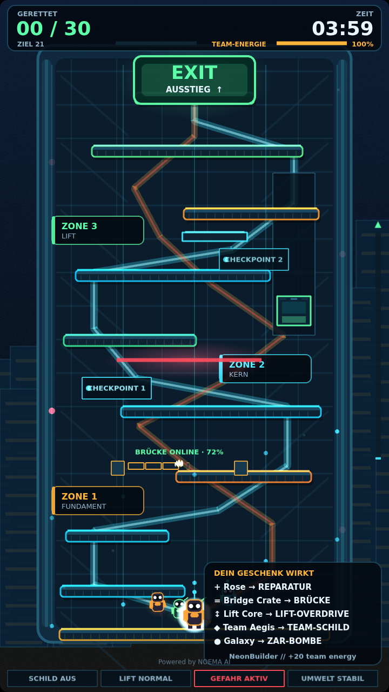
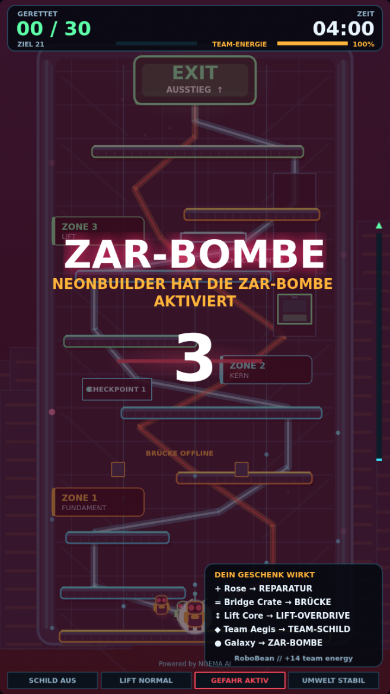

# NOEMA Live Games for TikTok

Interactive TikTok LIVE gaming platform powered by NOEMA AI.

This public repository contains the game runtime, the local operator panel, the
event protocol and the connectors that turn TikTok LIVE events into
transparent, configurable game actions.

[](https://www.paypal.com/cgi-bin/webscr?cmd=_donations&business=swoellner.pay@gmx.de&currency_code=EUR&item_name=NOEMA+Live+Games)

| Stream view (`?view=stream`) | ZAR-BOMBE sequence |
| --- | --- |
|  |  |

## NOEMA Ascent

The first playable mode. Around 30 autonomous robot workers climb a damaged
megastructure from bottom to top. Viewers help or sabotage with likes and
gifts; the community must rescue at least 21 of 30 before the round timer runs
out. The premium spectacle is the `ZAR-BOMBE`.

## Quick start

### Windows (installer)

Download `NOEMA-Ascent-Setup.exe` from the latest build and install it. The
package contains the built game and a small local web server based on Windows'
own `System.Net.HttpListener` — no Node.js, no Python, no runtime download.

Start "NOEMA Ascent" from the start menu: a console window opens with the
operator and stream URLs, and the browser opens the operator view. Keep the
console window open while playing.

The installer is built on a Windows runner by
[`.github/workflows/build-windows.yml`](.github/workflows/build-windows.yml)
and published as a build artifact. No binary is committed to this repository.

### From source

```bash
pnpm install
pnpm dev
```

Open `http://127.0.0.1:4173`.

### Offline mode

Start screen → **Offline testen**. No TikTok connection, no credentials. A local
mock source produces the same normalized events the bridge produces, so the
offline mode exercises the identical pipeline.

### Live Bridge mode

1. Start the [NOEMA TikTok Live Bridge](https://github.com/noema-ai-open/noema-tiktok-live-bridge)
   locally and configure the public TikTok account there.
2. Start screen → **Live Bridge verbinden**, address defaults to
   `http://127.0.0.1:8765`.
3. **Verbindung testen**, then **Verbinden & Runde starten**.

Details: [`docs/LIVE_BRIDGE_INTEGRATION.md`](docs/LIVE_BRIDGE_INTEGRATION.md).

## No TikTok credentials

The app never asks for a TikTok password, cookie, session id, QR login or access
token, and it has no NOEMA account, registration or cloud database. It talks to
the locally running bridge; the public account name is configured inside the
bridge. All processing is local.

## Views

| URL | Purpose |
| --- | --- |
| `http://127.0.0.1:4173/?view=operator` | Default. Game preview plus the local control panel. |
| `http://127.0.0.1:4173/?view=stream` | Clean 9:16 capture surface for the streaming software. |
| `…/?view=stream&autostart=1` | Same, and the round starts without a click. |

The stream view reuses the connection and accessibility settings last saved in
the operator view and shows no technical details.

### TikTok LIVE Studio

1. Start the installed app, or from source: `pnpm build` then `pnpm preview`
   (serves the built app on `http://127.0.0.1:4173`).
2. In LIVE Studio: **Quelle hinzufügen → Link**, paste
   `http://127.0.0.1:4173/?view=stream&autostart=1`.
3. Set the source size to **720 × 1280**.

Keep the operator view open in a normal browser window on the side — that is
where round controls, safe mode and the gift mapping live.

### OBS

Browser source, width 720, height 1280, same URL.

### Where things have to run

The bridge binds hard to `127.0.0.1` and is not reachable across the network by
design. The game page talks to the bridge from the machine it is displayed on.
So **bridge, game server and streaming software all belong on the same
machine** — a `127.0.0.1` bridge address cannot be reached from another host,
and serving the page from another host while pointing it at `127.0.0.1` is
blocked by the browser's private-network rules.

## Operator view

Connection state and source switching, round controls (start, pause, resume,
reset, seed), safe mode, reduced motion, mute and volume, test events for every
gift tier including gift streaks and duplicate events, tool diagnostics, the
gift mapping editor, unknown-gift log, live event log, ordered command log and
replay export/import.

## Gift mapping

Gifts are mapped locally by **gift id**; the gift name is only a fallback,
because TikTok catalogs change per region and over time. Each row carries an
action, a strength, a cooldown and an enabled flag, and is stored in
`localStorage`. Unknown gifts are logged and can be adopted with one click —
they never trigger a random effect.

See [`docs/GIFT_EVENT_PIPELINE.md`](docs/GIFT_EVENT_PIPELINE.md) for
deduplication, gift streaks and priority.

## Visuals

Every texture, shape and sound is generated at runtime. The repository contains
no third-party images, icons, fonts or audio files. See
[`docs/VISUAL_SYSTEM.md`](docs/VISUAL_SYSTEM.md).

## Privacy and local processing

- No cloud service is required, and none is contacted by the game.
- Settings and gift mappings live in the browser's `localStorage`.
- Viewer names are shown only for actions they triggered themselves.
- No credentials or secrets are stored in the browser bundle.

## Build and tests

```bash
pnpm typecheck
pnpm test
pnpm build
```

## Repository layout

```text
apps/game                 Browser game runtime (Phaser 3 + Vite)
  src/connectors          Mock and NOEMA Live Bridge connectors, normalization
  src/gifts               Catalog, streaks, rules engine, priority inbox
  src/render              World, robots, structures, effects, HUD, ZAR-BOMBE
  src/simulation          Deterministic fixed-step simulation
  src/ui                  Start screen, operator panel, mapping editor
packages/event-protocol   Shared live-event and game-command contracts
packaging                 Windows installer script and local static server
docs                      Architecture, game design, integration, visuals
```

## Known limitations

- The bridge sends no CORS headers, so the optional HTTP probes
  (`/status`, `/connection`) are blocked when the game runs on a different
  origin. The WebSocket event stream is unaffected and stays authoritative.
- The current bridge reports no gift id and no combo-final marker. Gift streaks
  are therefore finalized after a 2.5 s quiet window, and gift ids are derived
  from the gift name until a bridge version supplies them.
- The TikFinity adapter is a disabled placeholder.
- Camera work is deliberately static: the whole level fits the 9:16 frame.
- The bridge's TikTok connector uses an unofficial library and can break without
  notice; that limitation belongs to the bridge, not to this game.

## Projekt unterstützen

NOEMA Live Games bleibt kostenlos und öffentlich nutzbar. KI-Infrastruktur,
Tests, Grafik und Weiterentwicklung verursachen laufende Kosten. Wer das Projekt
gerne nutzt oder damit Einnahmen erzielt, kann die weitere Entwicklung
freiwillig unterstützen.

[Projekt unterstützen](https://www.paypal.com/cgi-bin/webscr?cmd=_donations&business=swoellner.pay@gmx.de&currency_code=EUR&item_name=NOEMA+Live+Games)

Support is voluntary. No feature is locked behind a payment.

## Principles

Practical AI. Human control.

No process injection, DLL hooking, password collection or session-cookie
harvesting. The platform is an integration layer, not a complete TikTok client.

## Branding

**Powered by NOEMA AI**

## License

MIT
